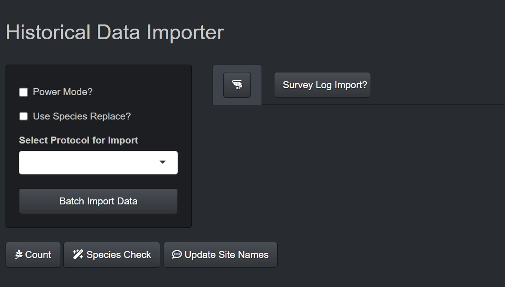
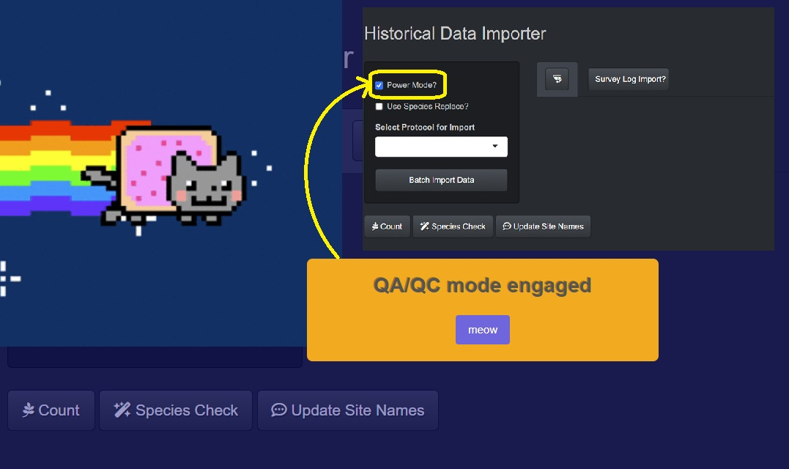
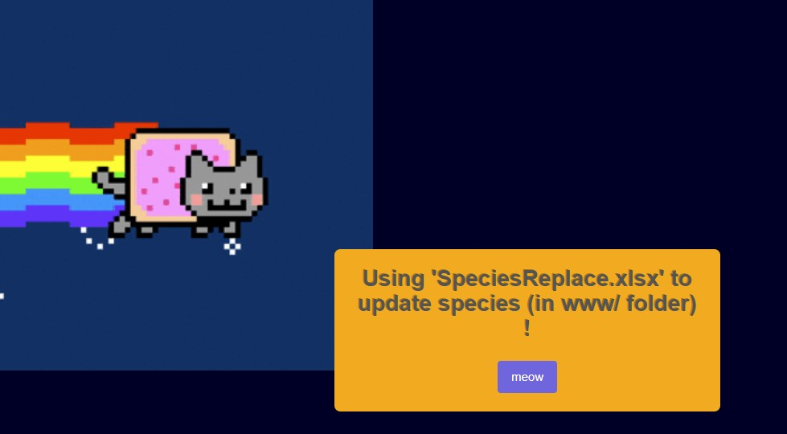
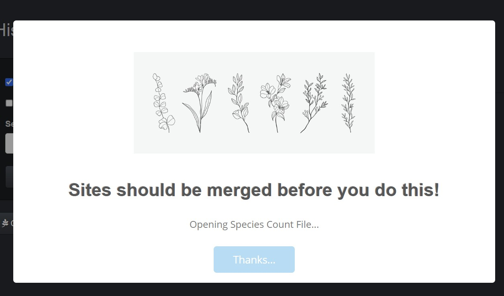
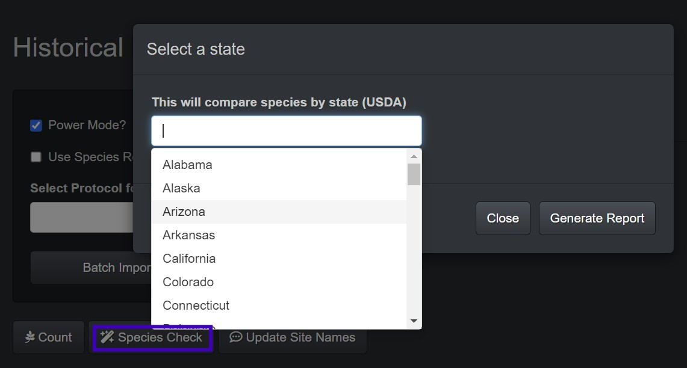
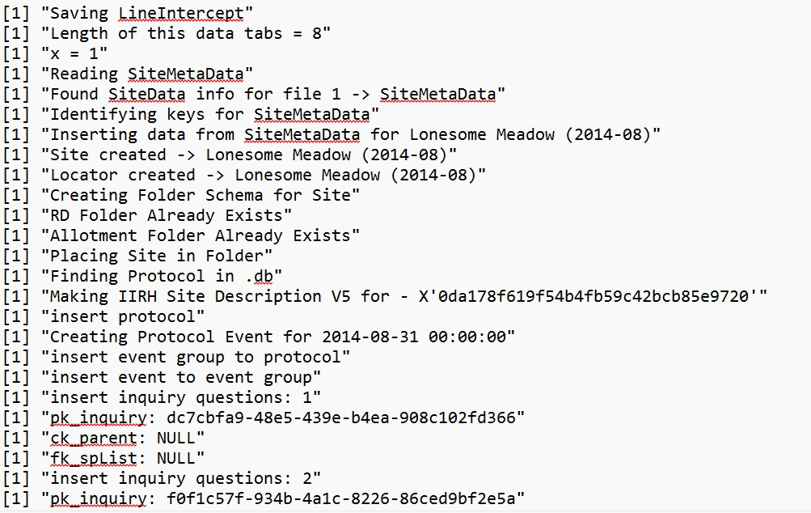

## ***VGS-Batch-Importer***

This R Shiny application was built as an ETL pipeline to ingest batch historical excel datasheets into a SQLite database. [Generic Data Sheets](www/Generic%20Sheets%20for%20Data%20Import/NestedFreq_GC_LineIntercept_HistoricalDataEntry_2025.xlsm) were build with QA validations built in. This example allows for site, point ground cover, line intercept, and nested frequency data for multiple transects to be ingested for multiple sheets at a time.

This app is specifically set to connect to a local [VGS](https://vgs.arizona.edu/) database. It can be adapted to be used for a variety of different digital data sheets that contain historical data in different formats. Basic structure works like so; reads data, parses data based on keys set in script (e.g., "SiteID" to find site name) and selected inputs from UI, organizes data, connects to local SQL database, creates and executes SQL insert statements to create site, site metadata, locations, protocols for event data (includes event groups and events in each eventgroup), then inserts sample data into each event. Various QA/QC checks are built in to prevent corrupt data from being inserted. Code can be seen at <https://github.com/tgilbert14/VGS-Batch-Importer-App>

------------------------------------------------------------------------

## ***Applications Details***

The app interface has options to select protocols available for ingest. It has various options depending on the import:

-   **Power Mode**: *This check box bypasses errors by generating and opening a excel workbook to review. The errors are then fixed and eventually the import happens with this setting turned off.*

-   **Species Replace**: *This check box enables a [SpeciesReplace.xlsx](www/SpeciesReplace.xlsx) file that can be used to mass update species codes for every file instead of going into each individual file and changing it individually. This is exceptionally helpful when a USDA code has had an update or a client uses the wrong code consistency.*

-   **Select Protocol for Import**: *Sampling protocols (quanitative data collection through VGS) are hard-coded for the selection drop down list. Surveys (qualative data collection through VGS) were designed later and query the local VGS database on your local machine to offer drop down selections for what surveys are available on the device to import data to.*

-   **Batch Import Data**: *This prompts a pop up window to select the batch import files to import (multiple .xlsx files can be imported at once).*

-   **Species Count**: *This button queries that VGS database and counts the species at each site to provide an overview of the data that was collected.*

-   **Species Check**: *This button brings a pop up that lets the client select a list of states that the sites are located. It then compares the plant codes in the database to USDA plant lists by each state (www/sp_lists_USDA) to check for inconsistencies and data entry errors.*

-   **Update Site Name**: *This links to a script that looks through all location lat/long coordinates and check them in a USFS enterprise shape file to help predict what folder (Allotment/Pasture) they belong in and rename them according to USFS naming conventions (numeric based off of Region-Forest-Ranger District-Allotment-Pasture-SiteID).*

-   **Survey Log Input?**: *This new feature offers survey (qualitative data) import with pre-built surveys. This section is still under development.*

-   **🦐**: *This is a help button that provides general workflow for batch importing data with this app.*

------------------------------------------------------------------------

## App Screenshots

##### *Power Mode* ⏬

------------------------------------------------------------------------
##### *Species Replace* ⏬

------------------------------------------------------------------------
##### *Species Count* ⏬

------------------------------------------------------------------------
##### *Species Check* ⏬

------------------------------------------------------------------------
*This app also generates a log text file stored in the 'www/' folder to track code flow and debug import issues.* ⏬

------------------------------------------------------------------------

*Contact me \@ [tsgilbert\@arizona.edu](mailto:tsgilbert@arizona.edu) for questions, feedback, suggestions, or if you want to collaborate!*
